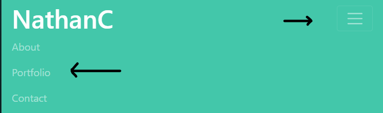
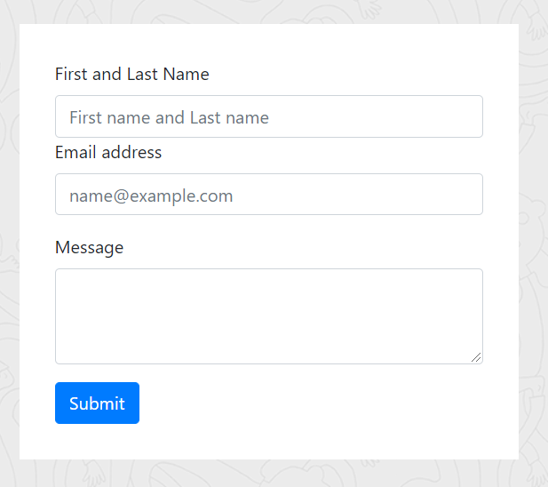
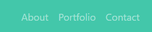

# Be in the know.

When ever someone transitions to the a new industry or persues a current industry, the best way for someone to show off their work is to showcase themselves so as to attract potential clients or employers.  With so much competition, the best way for someone to stand out is to shine their achievements.  To see and experience someones achievements and work is to know a part of who they are.  It is to be in the know.  

## Table of Contents

*[Purpose](#purpose)
*[Instillation](#instillation)
*[Features](#features)
*[Credits](#credits)
*[License](#license)

## Purpose  

The reason for the creation of this application is so that I can present myself to potential clients and employers.  This appliaction is to showcase my beginning portoflio that I will and have created during and after my time in the GA Tech/Trilogy Fullstack program.  The aim of this application is to grow with my skills and propel me further in the tech/web development industry.  As I grow, so too will this application. 

## Instillation 
**To edit/use the application, please follow the steps to pull the repository from GitHub through Git Bash and pull the script into VSCode, provided all three items are already installed on a local network.**

Instillation steps are as follows:
1. Access the repository at [Git Hub] https://github.com/Napica/HW-02-Get-to-know-portfolio. 
2. Click on the code section (in green) and clone the SSH key.  
3. Once the SSH key is cloned, open the terminal through Git Bash.
4. Find or create the folder the user wants to work in and enter the following commands the the Git terminal:
    1. git clone [copied link]    (*this will allow access the repository to the local computer.*)
    2. git pull (*this will pull all the lines of script from the local repository.*)
    3. code . (*This will extract the code and link the paths to VSCode for review/editing/uploading)

#### [For Direct Access to GitHub provided application site]

Please click on the link below: 
1. https://napica.github.io/HW-02-Get-to-know-portfolio/

## Features

This features is when a user views the application on mobile.  Since the base pixel recognition for a mobile device is 350px, this feature is designed to have give the user the ability to push the "button" and have access to other parts of the application. 

This feature is so that the user can send me a message if they are interested in my work.  It is designed to send a message from the applaction with their reference information.  

These are the links that a user can use to navigate from one page of the site to another.  

## Credits

I would like to give thanks to my classmates, TA's and my tutor in the overall implementation and creation of this application.  I would also like to thank the user Aseem on Stack OVerflow in helping with the basic concepts of the dropdown nav bar.  

## License 

Boot strap is licensed under the MIT Liscense.  Please refer to the link below for further information:

https://github.com/twbs/bootstrap/blob/v4.5.2/LICENSE